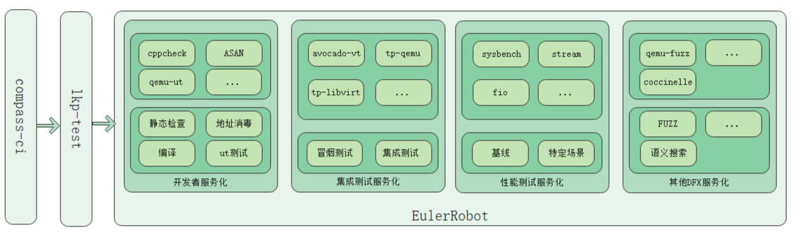

# EulerRobot

#### 介绍
A virtualized automated test project, integrated compilation test, UT test, smoke test, Avocado-VT test,etc.

#### 功能描述

- **虚拟化组件开发者服务**

	支持开发者对虚拟化组件自有分支代码进行编译、地址消毒编译、UT测试(包括qemu-ut、libvirt-ut、kvm-unit-test)、静态检查等验证，目前支持qemu、libvirt，可对接openEuler版本和upstream版本。
	
- **虚拟化组件冒烟测试、集成测试服务**

	支持对指定版本运行虚拟化冒烟测试、集成测试，同时支持替换运行环境中qemu为openeuler版本自带qemu的地址消毒版本或者upstream qemu的地址消毒版本。

- **虚拟化组件性能测试服务**

	提供虚拟化基线性能测试，包含cpu/mem/io等，并提供openeuler虚拟化特定场景性能测试模型，可快速完成指定版本性能验证。

- **其他DFX测试服务**

	后续提供更多的测试服务，包括FUZZ、语义搜索、可靠性等。
	
#### 软件架构

EulerRobot基于虚拟化各类测试套及测试能力，对接compass-ci给用户提供虚拟化平台验证服务。

相关虚拟化平台测试套仓库地址如下：

[https://gitee.com/src-openeuler/avocado](https://gitee.com/src-openeuler/avocado)

[https://gitee.com/openeuler/avocado-vt](https://gitee.com/openeuler/avocado-vt)

[https://gitee.com/openeuler/tp-libvirt](https://gitee.com/openeuler/tp-libvirt)

[https://gitee.com/openeuler/tp-qemu](https://gitee.com/openeuler/tp-qemu)

#### 安装教程

1.  用户需要有compass-ci账户，具备通过compass-ci提交任务的能力。具体可参考[https://gitee.com/openeuler/compass-ci.git](https://gitee.com/openeuler/compass-ci.git)
2.  下载EulerRobot仓库，执行script/autopatch.sh将相关文件按lkp-tests的目录结构拷贝到对应路径下

#### 使用说明
具体使用可参见compass-ci指导 [https://gitee.com/wu_fengguang/compass-ci](https://gitee.com/wu_fengguang/compass-ci)

此处简单介绍下当前提供的主要几个服务化能力

1.  开发者服务

	jobs/openeuler-qemu.yaml，此任务提供qemu版本编译、UT测试、cppcheck静态检查能力，支持配置地址消毒编译，支持指定upstream、openeuler集成的分支等不同分支编译

	jobs/openeuler-libvirt.yaml，此任务提供libvirt版本编译、UT测试，支持指定upstream、openeuler集成的分支等不同分支编译
2.  冒烟、集成测试服务

	jobs/virttest-depends.yaml，此任务需要在virttest_at/virttest_st任务之前执行，构建测试框架及测试用例正常运行所依赖rpm的dep包

	jobs/virttest-makepkg.yaml，此任务需要在virttest_at/virttest_st任务之前执行，构建测试框架部署、测试用例部署等测试运行前的pkg包，支持qemu地址消毒版本包构建

	jobs/virttest_at.yaml，此任务运行虚拟化冒烟测试，使用单物理主机测试环境，支持配置运行在openeuler集成qemu的地址消毒版本、upstream qemu的地址消毒版本

	jobs/virttest_at_2hosts.yaml，此任务运行虚拟化测试，使用双物理主机测试环境，支持配置运行在openeuler集成qemu的地址消毒版本、upstream qemu的地址消毒版本

	jobs/virttest_st.yaml，此任务运行虚拟化集成测试，使用单物理主机测试环境，支持配置运行在openeuler集成qemu的地址消毒版本、upstream qemu的地址消毒版本

	jobs/virttest_st_2hosts.yaml，此任务运行虚拟化集成测试，使用双物理机主机测试环境，支持配置运行在openeuler集成qemu的地址消毒版本、upstream qemu的地址消毒版本
3.  性能测试服务
	
	待补充

#### 参与贡献

1.  Fork 本仓库
2.  新建 Feat_xxx 分支
3.  提交代码
4.  新建 Pull Request

#### 码云特技

1.  使用 Readme\_XXX.md 来支持不同的语言，例如 Readme\_en.md, Readme\_zh.md
2.  码云官方博客 [blog.gitee.com](https://blog.gitee.com)
3.  你可以 [https://gitee.com/explore](https://gitee.com/explore) 这个地址来了解码云上的优秀开源项目
4.  [GVP](https://gitee.com/gvp) 全称是码云最有价值开源项目，是码云综合评定出的优秀开源项目
5.  码云官方提供的使用手册 [https://gitee.com/help](https://gitee.com/help)
6.  码云封面人物是一档用来展示码云会员风采的栏目 [https://gitee.com/gitee-stars/](https://gitee.com/gitee-stars/)
